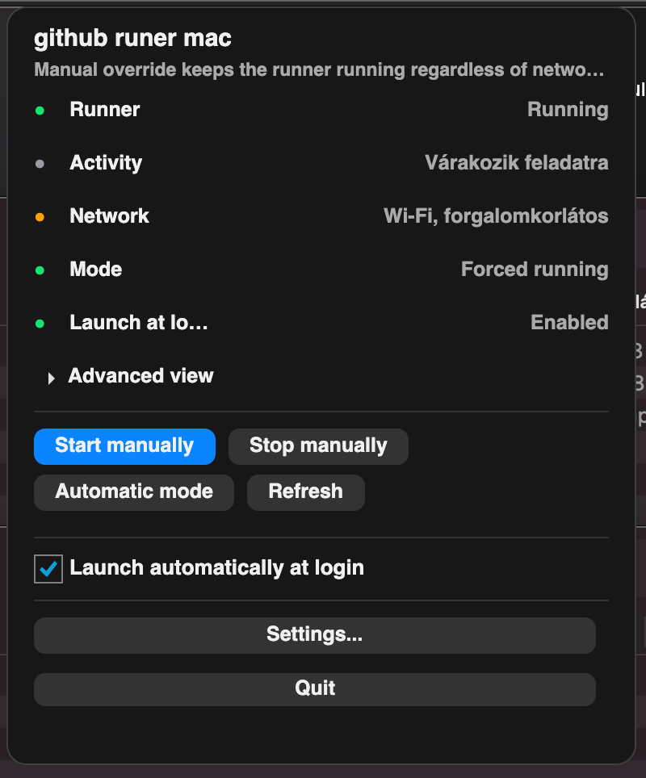
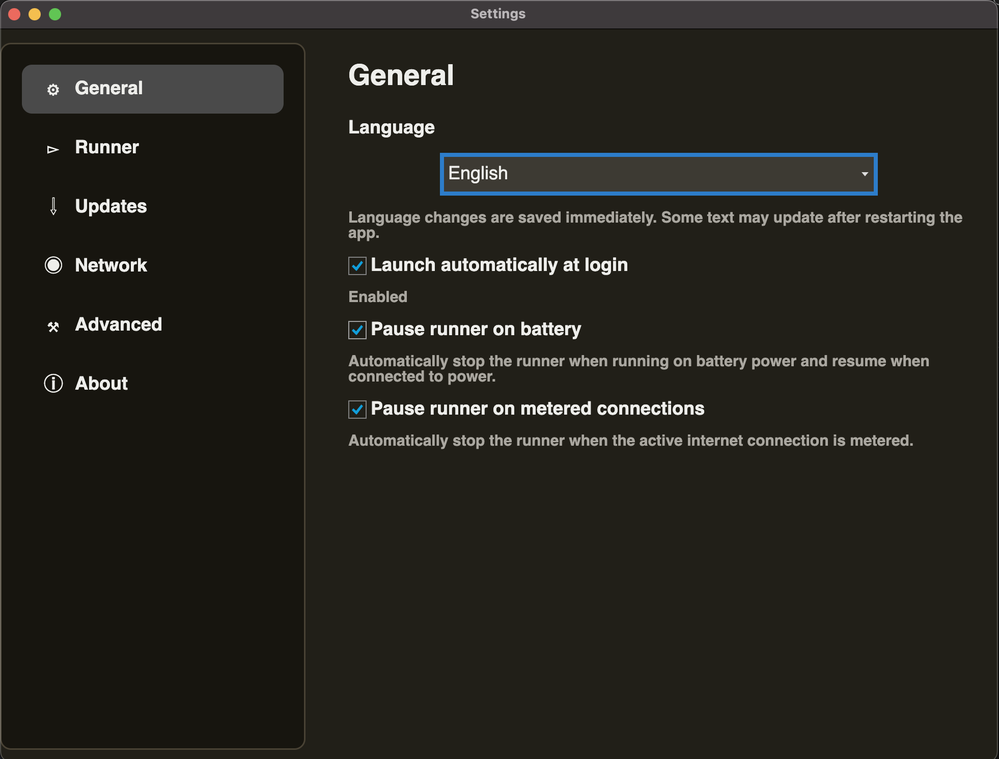

# GitRunnerManager

## Magyar

A **GitRunnerManager** egy macOS menüsorban futó alkalmazás helyi GitHub Actions self-hosted runner kezelésére. Indítja, leállítja és automatikus módban felügyeli a runnert, miközben figyeli a hálózatot, az akkumulátort, az erőforrás-használatot és az aktuális runner aktivitást.

### Fő funkciók

- Menüsor ikon állapotjelzéssel
- Kézi indítás, kézi leállítás, automatikus mód
- Workflow aktivitás felismerése a runner logokból
- Hálózatfigyelés: offline, korlátos és nem korlátos kapcsolat
- Automatikus szüneteltetés offline vagy korlátos hálózaton
- Akkumulátorfigyelés és opcionális automatikus szüneteltetés
- CPU-, memória- és aktív job figyelés
- Bejelentkezéskori indítás kezelése
- Beállítási ablak: Általános, Runner, Frissítések, Hálózat, Haladó, Névjegy
- Magyar és angol lokalizáció
- Frissítéskeresés GitHub Releases alapján, stabil és preview csatornával
- DMG készítés release-hez

### Swift macOS verzió

A natív macOS alkalmazás a `swfit/` mappában található. Swift 6, SwiftUI `MenuBarExtra`, SPM, `@Observable`, `@MainActor`, `Process` API és `NWPathMonitor` alapokra épül.

```bash
./scripts/build_and_run_swift.sh
```

Bundle készítése:

```bash
./scripts/build_and_run_swift.sh --bundle
```

DMG készítése:

```bash
APP_VERSION=1.0.0 ./scripts/build_dmg_swfit.sh
```

Az app bundle a `dist/GitRunnerManager.app`, a DMG a `release/` mappába kerül.

### Avalonia multiplatform verzió

Az `Avalonia/` mappa a C# / .NET 9 + Avalonia UI verziót tartalmazza Windows, macOS és Linux támogatással.

Új Avalonia funkciók:

- Több runner profil kezelése
- Runner hozzáadása varázslóval vagy meglévő mappa importálásával
- Repository és organization runner támogatás
- GitHub fiókok kezelése, személyes és szervezeti hozzáféréssel
- GitHub Actions irányítópult workflow futásokkal, job részletekkel és runner-korrelációval
- Repository szűrés, futások és jobok böngészőben megnyitása
- Diagnosztikai kontextus másolása vagy exportálása Markdown/JSON formátumban
- Runner log nézet és fejlesztői diagnosztika
- Runner frissítések és alkalmazásfrissítések kezelése
- Platformfüggő bejelentkezéskori indítás
- Windows, macOS és Linux publish scriptek

```bash
cd Avalonia
dotnet build
```

Release build:

```bash
./scripts/build.sh
```

Publish példák:

```bash
APP_VERSION=1.0.0 ./scripts/publish-macos-arm64.sh
APP_VERSION=1.0.0 ./scripts/publish-windows-x64.sh
APP_VERSION=1.0.0 ./scripts/publish-linux-x64.sh
```

A publikált alkalmazások az `Avalonia/publish/` mappába kerülnek.




## English

**GitRunnerManager** is a macOS menu bar app for managing a local GitHub Actions self-hosted runner. It can start, stop, and automatically supervise the runner while monitoring network state, battery state, resource usage, and runner activity.

### Features

- Menu bar status icon
- Manual start, manual stop, automatic mode
- Workflow activity detection from runner logs
- Network monitoring for offline, metered, and unmetered connections
- Automatic pause on offline or metered networks
- Battery monitoring with optional auto-pause
- CPU, memory, and active job monitoring
- Launch at login control
- Settings window: General, Runner, Updates, Network, Advanced, About
- English and Hungarian localization
- GitHub Releases update checks with stable and preview channels
- DMG release packaging

### Swift macOS version

The native macOS app lives in `swfit/`. It uses Swift 6, SwiftUI `MenuBarExtra`, SPM, `@Observable`, `@MainActor`, `Process`, and `NWPathMonitor`.

```bash
./scripts/build_and_run_swift.sh
```

Create an app bundle:

```bash
./scripts/build_and_run_swift.sh --bundle
```

Create a DMG:

```bash
APP_VERSION=1.0.0 ./scripts/build_dmg_swfit.sh
```

The app bundle is written to `dist/GitRunnerManager.app`, and the installer to `release/`.

### Avalonia cross-platform version

The `Avalonia/` folder contains the C# / .NET 9 + Avalonia UI version for Windows, macOS, and Linux.

New Avalonia features:

- Multiple runner profiles
- Add runner wizard and existing runner folder import
- Repository and organization runner support
- GitHub account management with personal and organization access
- GitHub Actions dashboard with workflow runs, job details, and runner correlation
- Repository filtering and browser links for runs/jobs
- Diagnostic context copy/export as Markdown or JSON
- Runner log viewer and developer diagnostics
- Runner updates and app updates
- Platform-specific launch at login
- Windows, macOS, and Linux publish scripts

```bash
cd Avalonia
dotnet build
```

Release build:

```bash
./scripts/build.sh
```

Publish examples:

```bash
APP_VERSION=1.0.0 ./scripts/publish-macos-arm64.sh
APP_VERSION=1.0.0 ./scripts/publish-windows-x64.sh
APP_VERSION=1.0.0 ./scripts/publish-linux-x64.sh
```

Published apps are written to `Avalonia/publish/`.

See [LICENSE](LICENSE) for licensing details.
